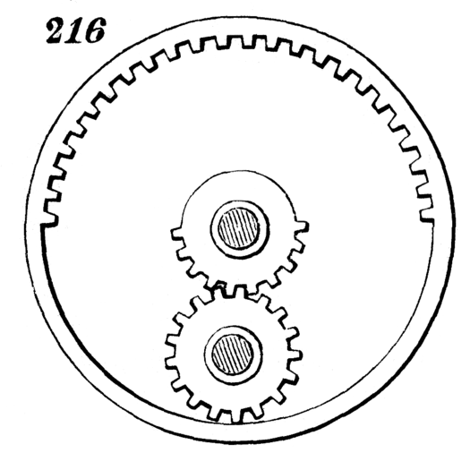

# Engrenage plus compliqué
Je vais essayer de faire un modèle plus compliqué : il tourne dans un premier sens, et puis repart deux fois plus vite dans l'autre sens. Pour quel usage ? 
J'ai me petite idée mais on verra plus tard. 

Le fichhier troisengrenages contient un assemblage qui semble marcher. 

J'ai utilisé le site https://hessmer.org/gears/InvoluteSpurGearBuilder.html, parce que inkscape ne sait pas faire des engrenages intérieurs, sauf à faire des différences, mais le 'négatif'
d'un bon engrenage n'est pas un bon engrenage. 
J'ai une solution qui à vue semble bonne, mais ça risque de coincer, il faudra peut-être passer à 14 dents au lieu de 15 pour le roue centrale. (39/15/11)

